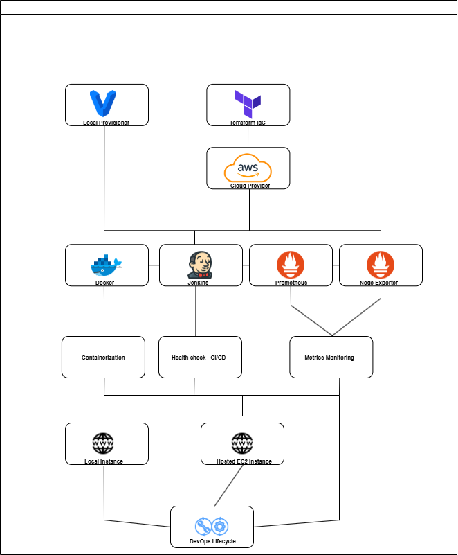
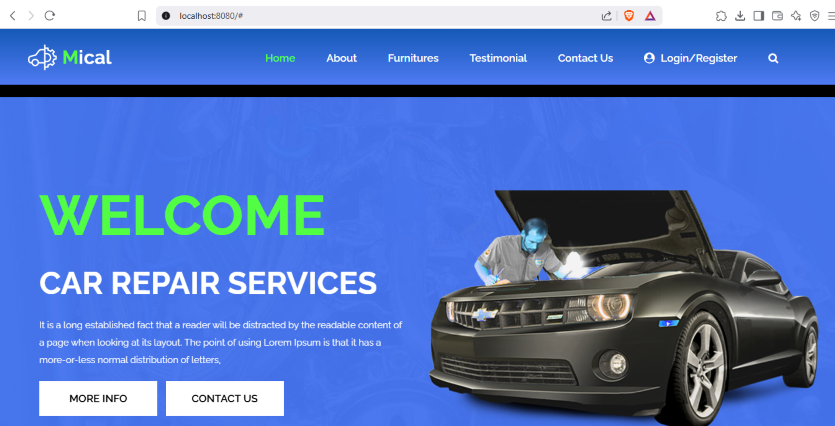
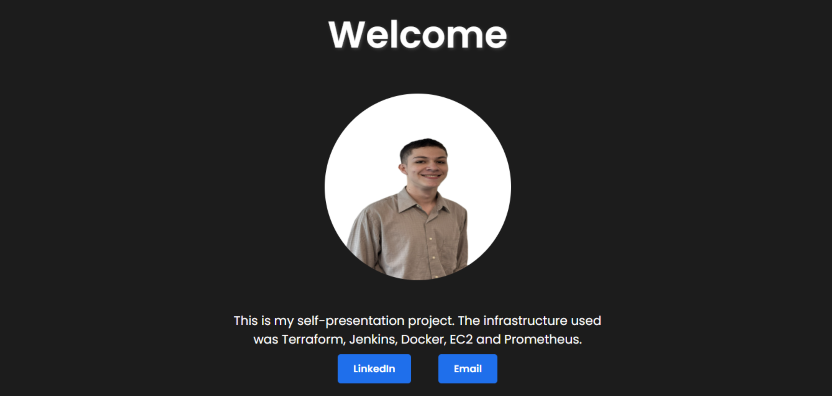
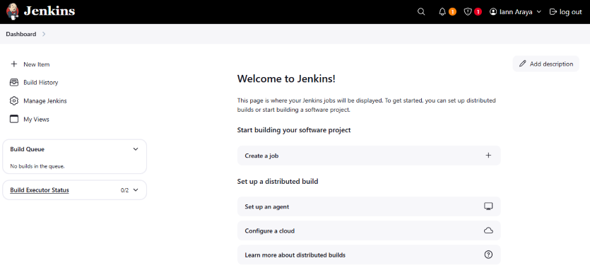
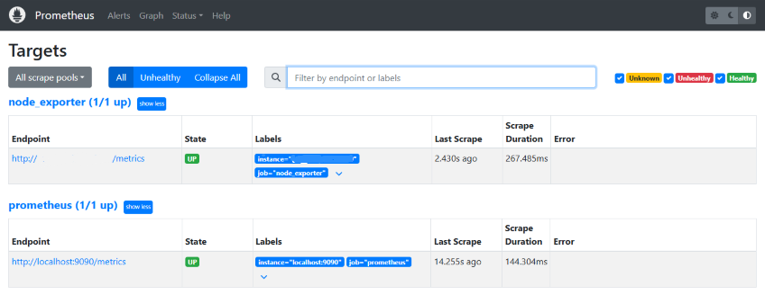
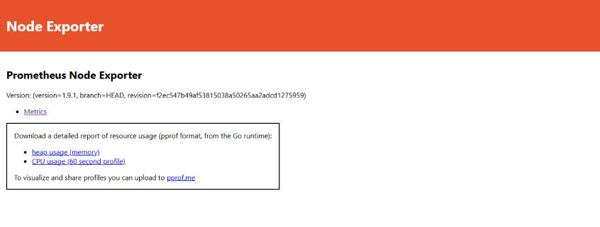

# 🌐 DevOps Static Website Hosting Project

This project demonstrates a complete DevOps pipeline to deploy and monitor a static HTML website using modern infrastructure-as-code and containerization tools.

## 🚀 Overview

The HTML site is hosted in a Docker container running Apache HTTP Server. The infrastructure is provisioned via Terraform on AWS, with Jenkins for health checks and Prometheus + Node Exporter for monitoring system metrics.

## 🛠️ Technologies Used

- **AWS** - IAM, VPC, EC2, Elastic IP and Cloudwatch integration
- **Docker** – Containerization of the Apache web server
- **Jenkins** – Health checks and basic automation
- **Terraform** – Infrastructure provisioning on AWS EC2
- **Prometheus** – Monitoring and metric collection
- **Node Exporter** – System-level metrics
- **Vagrant** – Local development and testing environment

## 📁 Project Structure

```
.
├── Docker/                    # Builds Apache-based HTML site container
├── Jenkins/                   # Automation healthcheck pipeline
├── Prometheus/                # Prometheus configuration
├── Terraform/                 # Terraform infrastructure definition
├── Vagrant                    # Local VM provisioning
├── html_data/                 # Static HTML content (photo, intro, buttons)
├── visual-resources           # README visual content
└── README.md
```

## 🔧 Features

- Static website with personal intro and contact buttons (LinkedIn & Gmail)
- Jenkins health check job with alert mechanism
- Prometheus scraping from EC2 and local Node Exporter
- Infrastructure as Code with Terraform
- Vagrant box for quick local deployments

## 📄 Project diagram

*Visual explaning of the project infrastructure*



## 📸 Screenshots

- *Local instance working with HTML template*



- *AWS instance with the HTML website working*




- *Jenkins accessible from port 8080*




- *Prometheus accesible and linked with Node Exporter from port 9090*





- *Node Exporter accesible from port 9100*





## 📬 Contact

Feel free to reach out for job opportunities, questions or suggestions:

- [LinkedIn](https://www.linkedin.com/in/ian-araya-jimenez)
- [Gmail](mailto:jimz.ianar@gmail.com)

---


